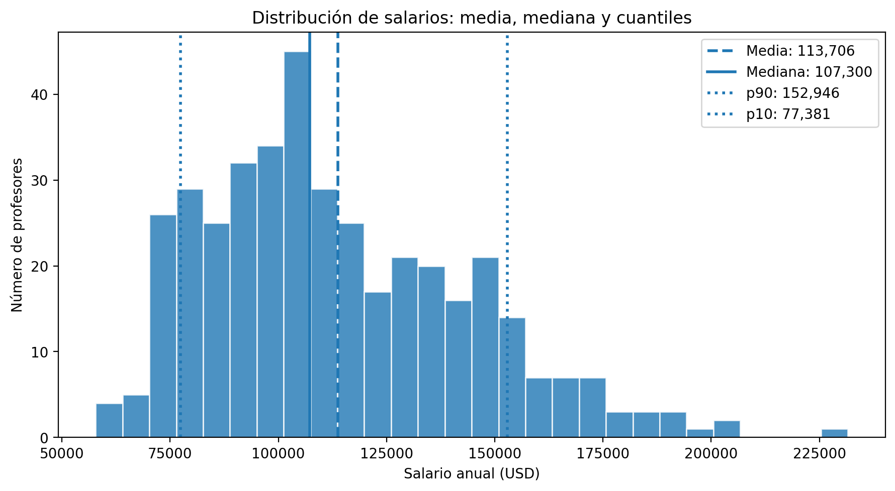
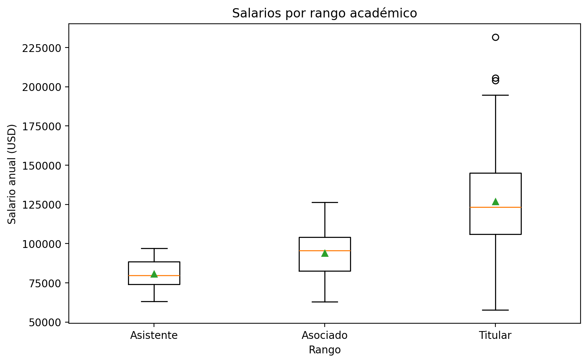
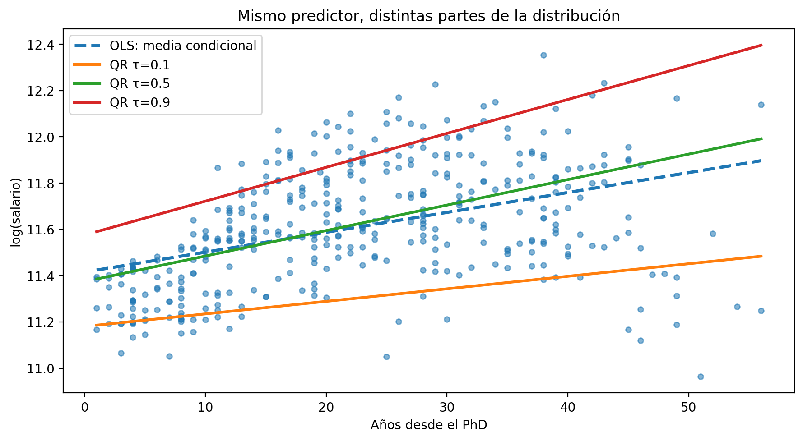

```{r setup, include = FALSE}
library(knitr)
library(tidyverse)
library(readxl)
library(quantreg)
library(broom)
library(purrr)
library(scales)
library(fontawesome)

knitr::opts_chunk$set(echo = FALSE,
                      dpi = 300,
                      warning = FALSE,
                      message = FALSE,
                      error = FALSE)

options(htmltools.dir.version = FALSE)
```

class: inverse, left, bottom
background-image: url("img/fondo.jpg")
background-size: cover

# **`r rmarkdown::metadata$title`**
----

## **`r rmarkdown::metadata$subtitle`**

### `r rmarkdown::metadata$author`
### `r rmarkdown::metadata$date`

```{r xaringanExtra-share-again, echo=FALSE}
 xaringanExtra::use_share_again()
```

```{r xaringanExtra-clipboard, echo=FALSE}
 xaringanExtra::use_clipboard()
```


```{r xaringanExtra, echo=FALSE}
xaringanExtra::use_xaringan_extra("tile_view")
```


---

class: center, middle, inverse

# Ruta de la sesión de hoy

## Media → cuantiles → modelo cuantílico → interpretación → decisión

<br>

.orange[La idea no es cambiar de modelo por moda, sino mirar la parte de la distribución que realmente importa.]

---

# ¿Dónde quedamos?

En la clase anterior trabajamos modelos predictivos y validación.

--

Hoy cambiamos la pregunta.

### Antes:
¿Cuál es la predicción promedio de `Y`?

### Ahora:
¿Cómo cambia `Y` en la parte baja, media y alta de la distribución?

--

.center[
.orange[No siempre el negocio vive en el promedio.]
]

---

# Pregunta de arranque

Supongamos que una empresa quiere analizar salarios.

### Modelo clásico
¿Cuánto aumenta el salario promedio cuando aumenta la experiencia?

--

### Modelo cuantílico
¿La experiencia pesa igual en salarios bajos, medios y altos?

--

.center[
.orange[La segunda pregunta es más útil cuando hay desigualdad, colas o heterogeneidad.]
]

---

# La idea en una frase

.center[
.font150[Regresión lineal estima la **media condicional**.]
]

<br>

.center[
.font150[Regresión cuantílica estima **cuantiles condicionales**.]
]

--

### Traducción sencilla
No pregunta solo “cuánto sube en promedio”, sino:

- cuánto sube en el p10,
- cuánto sube en la mediana,
- cuánto sube en el p90.

---

class: center, middle, inverse

# ¿Por qué no basta la media?
## Mini-ejemplos de decisión

---

# Ejemplo 1: cafetería

Tiempos de espera en minutos:

.center[
.font130[`2, 3, 3, 4, 4, 4, 5, 5, 6, 12`]
]

--

### Resumen

- media = 4.8 minutos
- mediana = 4 minutos
- p90 = 6 minutos

--

### Decisión
Si prometo “5 minutos”, la media parece tranquila.

Pero el p90 muestra que para cumplirle al 90% de estudiantes necesito pensar en **6 minutos**.

---

# Ejemplo 2: entregas

### Zona urbana
`2, 2, 3, 3, 3, 3, 4, 4, 4, 5`

- media = 3.3 días
- p90 = 4 días

--

### Zona periférica
`2, 3, 3, 3, 4, 4, 5, 6, 8, 9`

- media = 4.7 días
- p90 = 8 días

--

.center[
.orange[La diferencia grave no está solo en la media. Está en la cola alta.]
]

---

# Ejemplo 3: promoción comercial

Una promoción 2x1 no mueve igual a todas las tiendas.

--

### Tiendas top
p90 del incremento de ventas = 60%

### Tiendas bajas
p90 del incremento de ventas = 8%

--

### Decisión

En tiendas top puedo sostener inventario y promoción.

En tiendas bajas quizás debo cambiar categoría, precio o segmento.

---

# Señales de que necesitas cuantiles

Usa regresión cuantílica cuando:

- la distribución es sesgada,
- hay datos extremos,
- los efectos no parecen iguales para todos,
- te importan pérdidas, tiempos, ingresos, salarios o incumplimientos,
- necesitas diseñar políticas por percentiles.

--

.center[
.orange[Si el problema tiene cola, la media se queda corta.]
]

---

class: center, middle, inverse

# Cuantiles
## Lo que medimos antes de modelar

---

# ¿Qué es un cuantil?

Un cuantil divide una distribución.

--

### Ejemplos

- p10: valor por debajo del cual está el 10% de los datos.
- p50: mediana.
- p90: valor por debajo del cual está el 90% de los datos.

--

### Lectura de negocio

El p90 de tiempos de entrega no es “un promedio”.

Es un umbral de servicio: 90% de los pedidos llegan antes de ese punto.

---

# Dos tipos de cuantiles

### Cuantiles incondicionales
Resumen global de una variable.

Ejemplo: p90 de todos los salarios.

--

### Cuantiles condicionales
Resumen de `Y` dado un nivel de `X`.

Ejemplo: p90 del salario para personas con más experiencia.

--

.center[
.orange[La regresión cuantílica trabaja con cuantiles condicionales.]
]

---

# Fórmula comparativa

### Regresión lineal

$$E(Y|X)=X\beta$$

estima cómo cambia el promedio condicional.

--

### Regresión cuantílica

$$Q_{\tau}(Y|X)=X\beta_{\tau}$$

estima cómo cambia el cuantil condicional $\tau$.

--

.center[
.orange[El subíndice $\tau$ es la clave: cada cuantil puede tener su propio coeficiente.]
]

---

# ¿Qué significa $\tau$?

$\tau$ es el cuantil que quiero estimar.

--

### Valores comunes

- $\tau = 0.10$: parte baja de la distribución.
- $\tau = 0.50$: mediana.
- $\tau = 0.90$: parte alta.

--

### En lenguaje simple

No hay un solo modelo.

Hay un modelo para cada parte de la distribución.

---

# ¿Qué cambia frente a OLS?

OLS busca la recta que minimiza errores cuadrados.

$$\min \sum_i (y_i - x_i'\beta)^2$$

--

Regresión cuantílica minimiza una pérdida asimétrica.

$$\min \sum_i \rho_{\tau}(y_i - x_i'\beta_{\tau})$$

--

.center[
.orange[Por eso puede apuntar al p10, p50 o p90, no solo al promedio.]
]

---

# La pérdida cuantílica en palabras

Para estimar el p90, el modelo castiga más quedarse por debajo del dato.

Para estimar el p10, castiga más quedarse por encima.

--

### Intuición

El modelo se acomoda para que aproximadamente:

- 10% de datos queden por debajo de la línea p10,
- 50% queden por debajo de la mediana,
- 90% queden por debajo de la línea p90.

---

# Ojo con esta confusión

Regresión cuantílica no es “correr OLS sobre el 10% más bajo”.

--

### No es eso

No separo la muestra y modelo pedacitos.

--

### Sí es esto

Uso todos los datos, pero cambio la función objetivo para estimar un cuantil condicional.

--

.center[
.orange[Todos los datos aportan, pero el objetivo cambia.]
]

---

class: center, middle, inverse

# Base de trabajo
## Salarios académicos

---

# Vamos a usar un solo ejemplo

Trabajaremos con la base **`Salaries`**.

### Variable objetivo
`salary`: salario académico anual.

--

### Predictores

- rango académico,
- disciplina,
- años desde el PhD,
- años de servicio,
- sexo.

--

### Pregunta central
¿Los factores explican igual los salarios bajos, medianos y altos?

---

# Cargar datos

```{r, echo=TRUE}
library(tidyverse)
library(readxl)

salarios <- read_excel("Datos/Salaries.xlsx")

salarios <- salarios %>%
  rename(
    yrs_since_phd = `yrs.since.phd`,
    yrs_service   = `yrs.service`
  ) %>%
  mutate(
    rank = factor(rank),
    discipline = factor(discipline),
    sex = factor(sex),
    log_salary = log(salary)
  )

glimpse(salarios)
```

---

# ¿Por qué usar log salario?

Porque el salario suele ser asimétrico.

--

### Ventaja práctica

En un modelo con `log_salary`, los coeficientes se leen aproximadamente como cambios porcentuales.

--

### Ejemplo

Un coeficiente de 0.03 se interpreta aproximadamente como 3% más salario.

--

.center[
.orange[Esto facilita la conversación con gerencia.]
]

---

# Primer vistazo a la distribución


.center[

]

---

# Lectura del gráfico

En esta base:

- n = 397 observaciones,
- media ≈ 113,706,
- mediana ≈ 107,300,
- p10 ≈ 77,381,
- p90 ≈ 152,946.

--

### Mensaje
La media resume, pero no muestra bien la distancia entre la parte baja y alta.

---

# Salarios por rango


.center[

]


---

# Lectura de negocio

Un modelo promedio puede decir:

“ser profesor titular aumenta el salario en X%”.

--

Pero la pregunta cuantílica es más fina:

### ¿Ese diferencial es igual en salarios bajos, medianos y altos?

--

.center[
.orange[Esa pregunta es la que OLS no responde bien.]
]

---

class: center, middle, inverse

# Primer modelo
## `salary` explicado por años desde el PhD

---

# Modelo OLS simple

```{r, echo=TRUE}
modelo_lm_simple <- lm(
  log_salary ~ yrs_since_phd,
  data = salarios
)

summary(modelo_lm_simple)
```

--

### Qué responde
¿Cómo cambia el salario promedio cuando aumentan los años desde el PhD?

---

# Modelo cuantílico simple

```{r, echo=TRUE}
library(quantreg)

taus <- c(0.10, 0.50, 0.90)

modelo_qr_simple <- rq(
  log_salary ~ yrs_since_phd,
  tau = taus,
  data = salarios
)

summary(modelo_qr_simple, se = "nid")
```

--

### Qué responde
¿Cómo cambia el p10, p50 y p90 del salario cuando aumentan los años desde el PhD?

---

# Visualmente


.center[

]


---

# Cómo leer estas líneas


### OLS
Efecto sobre la media condicional.

### QR p10
Efecto en la parte baja del salario.

### QR p50
Efecto en la mediana.

### QR p90
Efecto en la parte alta.

---

# Interpretación del coeficiente

Supongamos que el coeficiente de `yrs_since_phd` es:

- 0.005 en p10,
- 0.011 en p50,
- 0.014 en p90.

--

### Lectura
Un año adicional desde el PhD se asocia con:

- 0.5% más salario en p10,
- 1.1% más en la mediana,
- 1.4% más en p90.

--

.center[
.orange[No es el mismo efecto en toda la distribución.]
]

---

# Ojo: asociación, no magia causal

Esta clase no convierte automáticamente el modelo en causal.

--

### El modelo cuantílico dice
condicional a las variables incluidas, el predictor se asocia con distintos cuantiles de `Y`.

--

### No dice por sí solo
que si aumento `X`, todos los individuos cambiarán exactamente así.

--

.center[
.orange[La interpretación debe cuidar el diseño del estudio.]
]

---
class: center, middle, inverse

# Modelo completo
## ¿Qué cambia cuando dejamos de mirar solo el promedio?

---

# Primero: el modelo OLS

```{r modelo_ols_completo, echo=TRUE, results='hide'}
modelo_lm <- lm(
  log_salary ~ yrs_since_phd + yrs_service + rank + discipline + sex,
  data = salarios
)

summary(modelo_lm)
```

--

### ¿Qué estamos estimando?

OLS responde una pregunta muy concreta:

.center[
.font130[
**¿Cómo cambia el salario promedio condicional cuando cambia X, manteniendo constantes las demás variables?**
]
]

--

Como la variable dependiente es `log_salary`, podemos transformar los coeficientes a cambios porcentuales:

$$100\left(e^{\beta}-1\right)$$

---

# OLS: resultados en lenguaje de negocio

```{r tabla_ols_limpia, echo=FALSE}
nombre_variable <- function(x) {
  dplyr::recode(
    x,
    "yrs_since_phd" = "Años desde el PhD",
    "yrs_service" = "Años de servicio",
    "rankAsstProf" = "Asistente vs. Asociado",
    "rankProf" = "Profesor vs. Asociado",
    "disciplineB" = "Disciplina B vs. A",
    "sexMale" = "Hombre vs. Mujer",
    "(Intercept)" = "Intercepto"
  )
}

tabla_ols <- broom::tidy(modelo_lm) %>%
  filter(term != "(Intercept)") %>%
  mutate(
    Variable = nombre_variable(term),
    efecto_pct = 100 * (exp(estimate) - 1),
    `Efecto estimado` = sprintf("%+.2f%%", efecto_pct),
    `p-valor` = ifelse(
      p.value < 0.001,
      "<0.001",
      sprintf("%.3f", p.value)
    ),
    `¿p < 0.05?` = ifelse(p.value < 0.05, "Sí", "No")
  ) %>%
  select(Variable, `Efecto estimado`, `p-valor`, `¿p < 0.05?`)

knitr::kable(
  tabla_ols,
  align = c("l", "c", "c", "c")
)
```

.center[
.font80[
**Nota:** los porcentajes corresponden a cambios multiplicativos aproximados/exactos derivados del modelo en logaritmos.
]
]

---

# ¿Qué nos cuenta OLS?

### Tres resultados muy claros

.pull-left[

**Rango académico**

- Profesor vs. Asociado: **+34.4%**
- Asistente vs. Asociado: **−14.2%**

El rango académico aparece fuertemente asociado con el salario.

]

.pull-right[

**Disciplina**

Trabajar en la disciplina B se asocia con aproximadamente:

### **+14.1%**

frente a la disciplina A.

]

--

### Pero hay algo menos claro...

Años desde el PhD:

### **+0.33% por año**

pero con `p = 0.089`.

.center[
.orange[Con OLS no encontramos evidencia fuerte, al 5%, de un efecto promedio de los años desde el PhD.]
]

---

# Ojo con los años de experiencia

El modelo contiene simultáneamente:

- `yrs_since_phd`: años desde el doctorado.
- `yrs_service`: años de servicio.

--

OLS estima:

### Años de servicio: aproximadamente **−0.39% por año**
`p = 0.022`

--

Pero la lectura correcta NO es:

.center[
.red["Trabajar más años reduce el salario."]
]

--

La interpretación es:

> Manteniendo constantes los años desde el PhD, rango, disciplina y sexo, un año adicional de servicio está asociado con un salario ligeramente menor.

.center[
.orange[Estamos estimando efectos parciales, no relaciones causales simples.]
]

---

# ¿Y qué tan bien explica el modelo?

El modelo OLS obtiene:

.center[
.font160[
\(R^2 = 0.525\)
]
]

Aproximadamente **52.5% de la variación de `log_salary`** es explicada por las variables incluidas.

--

Además, el modelo es globalmente significativo:

\[
p < 0.001
\]

--

### Pero...

.center[
.font130[
**Un buen modelo promedio todavía puede ocultar historias diferentes dentro de la distribución.**
]
]

---

class: center, middle, inverse

# Regresión cuantílica
## La misma pregunta, en distintas partes de la distribución

---

# El mismo modelo en cinco cuantiles

```{r modelo_qr_completo, echo=TRUE, results='hide'}
taus <- c(0.10, 0.25, 0.50, 0.75, 0.90)

modelo_qr <- rq(
  log_salary ~ yrs_since_phd + yrs_service + rank + discipline + sex,
  tau = taus,
  data = salarios
)
```

Ahora preguntamos:

.center[
.font130[
**¿El efecto de X es igual para salarios condicionalmente bajos, medios y altos?**
]
]

--

- \(\tau=0.10\): parte baja
- \(\tau=0.50\): mediana
- \(\tau=0.90\): parte alta

---

# Construimos una tabla limpia

```{r construir_tabla_qr, echo=TRUE}
qr_tabla <- purrr::map_dfr(taus, function(tau_actual) {

  modelo <- rq(
    log_salary ~ yrs_since_phd + yrs_service +
      rank + discipline + sex,
    tau = tau_actual,
    data = salarios
  )

  broom::tidy(modelo, se.type = "nid") %>%
    mutate(
      tau = tau_actual,
      conf.low = estimate - 1.96 * std.error,
      conf.high = estimate + 1.96 * std.error
    )
})
```

---

# ¿Cómo cambia cada efecto?

```{r tabla_qr_porcentajes, echo=FALSE}
tabla_qr_slide <- qr_tabla %>%
  filter(term != "(Intercept)") %>%
  mutate(
    Variable = nombre_variable(term),
    efecto_pct = 100 * (exp(estimate) - 1),
    valor = paste0(
      sprintf("%+.2f", efecto_pct),
      ifelse(p.value < 0.05, "*", "")
    ),
    Cuantil = paste0("p", tau * 100)
  ) %>%
  select(Variable, Cuantil, valor) %>%
  tidyr::pivot_wider(
    names_from = Cuantil,
    values_from = valor
  )

knitr::kable(
  tabla_qr_slide,
  align = c("l", rep("c", 5))
)
```

.center[
.font75[
`*` indica \(p<0.05\). Valores expresados como cambio porcentual aproximado en el salario.
]
]

---

# El resultado central

## Años desde el PhD

.pull-left[

### p10

Coeficiente:

\[
-0.00295
\]

Equivale aproximadamente a:

### **−0.29% por año**

`p = 0.002`

]

.pull-right[

### p90

Coeficiente:

\[
0.00899
\]

Equivale aproximadamente a:

### **+0.90% por año**

`p < 0.001`

]

--

.center[
.font130[
.orange[El efecto cambia de signo a lo largo de la distribución.]
]
]

---

# ¿Qué ocurrió en la mitad?

| Cuantil | Efecto de años desde PhD | p-valor |
|:---:|---:|---:|
| p10 | **−0.29%** | 0.002 |
| p25 | −0.36% | 0.208 |
| p50 | +0.04% | 0.888 |
| p75 | +0.60% | 0.083 |
| p90 | **+0.90%** | <0.001 |

--

### La historia no es lineal

En la parte central de la distribución el efecto prácticamente desaparece.

En la parte alta se vuelve claramente positivo.

En la parte baja aparece negativo.

.center[
.orange[Un único coeficiente OLS de +0.33% mezcla estas relaciones diferentes.]
]

---

# OLS vs. regresión cuantílica

.pull-left[

### OLS

$$\hat\beta = 0.00329$$

Aproximadamente:

### **+0.33%**

`p = 0.089`

Una sola respuesta para toda la distribución.

]

.pull-right[

### Regresión cuantílica

- p10: **−0.29%**
- p50: **+0.04%**
- p90: **+0.90%**

La relación cambia dependiendo del cuantil.

]

--

.center[
.font125[
**OLS no estaba necesariamente equivocado. Estaba resumiendo efectos que se compensan entre sí.**
]
]

---

# Perfil de coeficientes

En lugar de colocar todos los coeficientes sobre la misma escala, los separamos por variable.

```{r perfil_coeficientes_limpio, fig.width=10.5, fig.height=5.6, out.width="70%"}

perfil_plot <- qr_tabla %>%
  filter(term != "(Intercept)") %>%
  mutate(
    Variable = nombre_variable(term),
    efecto_pct = 100 * (exp(estimate) - 1),
    low_pct = 100 * (exp(conf.low) - 1),
    high_pct = 100 * (exp(conf.high) - 1)
  )

ols_plot <- broom::tidy(modelo_lm) %>%
  filter(term != "(Intercept)") %>%
  mutate(
    Variable = nombre_variable(term),
    efecto_pct = 100 * (exp(estimate) - 1)
  )

ggplot(
  perfil_plot,
  aes(x = tau, y = efecto_pct)
) +
  geom_hline(
    yintercept = 0,
    linetype = "dotted",
    color = "gray55"
  ) +
  geom_ribbon(
    aes(ymin = low_pct, ymax = high_pct),
    fill = "#D55E00",
    alpha = 0.15
  ) +
  geom_line(
    color = "#D55E00",
    linewidth = 1
  ) +
  geom_point(
    color = "#D55E00",
    size = 2
  ) +
  geom_hline(
    data = ols_plot,
    aes(yintercept = efecto_pct),
    inherit.aes = FALSE,
    linetype = "dashed",
    color = "gray30",
    linewidth = 0.8
  ) +
  facet_wrap(
    ~ Variable,
    scales = "free_y",
    ncol = 3
  ) +
  scale_x_continuous(
    breaks = c(0.10, 0.50, 0.90),
    labels = scales::label_percent(accuracy = 1)
  ) +
  labs(
    title = "Cómo cambian los efectos a lo largo de la distribución",
    subtitle = "Naranja: regresión cuantílica. Línea gris: estimación OLS.",
    x = "Cuantil del salario condicional",
    y = "Efecto estimado sobre el salario (%)"
  ) +
  theme_minimal(base_size = 13) +
  theme(
    plot.title = element_text(face = "bold"),
    panel.grid.minor = element_blank(),
    strip.text = element_text(face = "bold")
  )
```

.center[
.font70[
Cada panel utiliza su propia escala vertical. Compare la **forma del efecto**, no la altura entre paneles.
]
]

---

# ¿Qué historias aparecen?

### Rango académico

El premio asociado a ser **Profesor**, frente a Profesor Asociado, aumenta claramente:

$$23.3\% \quad \rightarrow \quad 41.4\%$$

de p10 a p90.

--

### Disciplina

La disciplina B presenta una prima positiva en **todos los cuantiles**.

Su mayor magnitud aparece alrededor de la mediana.

--

### Sexo

El coeficiente de Hombre vs. Mujer **no presenta un patrón monotónico**:

es significativo en algunos cuantiles y no en otros.

.center[
.orange[No sería correcto resumir estos resultados diciendo simplemente que existe una brecha salarial constante por sexo.]
]

---

# El gráfico clave: QR frente a OLS

.center[
.font110[
Ahora concentrémonos únicamente en **años desde el PhD**.
]
]

```{r grafico_qr_ols_bandas, fig.width=10.5, fig.height=5.1, out.width="70%"}

taus_finos <- seq(0.05, 0.95, by = 0.05)

formula_salarios <- log_salary ~ yrs_since_phd + yrs_service +
  rank + discipline + sex

perfil_qr_ci <- purrr::map_dfr(taus_finos, function(tau_actual) {

  modelo <- rq(
    formula_salarios,
    tau = tau_actual,
    data = salarios
  )

  broom::tidy(modelo, se.type = "nid") %>%
    mutate(
      tau = tau_actual,
      conf.low = estimate - 1.96 * std.error,
      conf.high = estimate + 1.96 * std.error
    )
})

perfil_ols_ci <- broom::tidy(modelo_lm) %>%
  mutate(
    conf.low = estimate - 1.96 * std.error,
    conf.high = estimate + 1.96 * std.error
  )

var_clave <- "yrs_since_phd"

qr_clave <- perfil_qr_ci %>%
  filter(term == var_clave) %>%
  mutate(
    efecto_pct = 100 * (exp(estimate) - 1),
    low_pct = 100 * (exp(conf.low) - 1),
    high_pct = 100 * (exp(conf.high) - 1)
  )

ols_clave <- perfil_ols_ci %>%
  filter(term == var_clave) %>%
  mutate(
    efecto_pct = 100 * (exp(estimate) - 1),
    low_pct = 100 * (exp(conf.low) - 1),
    high_pct = 100 * (exp(conf.high) - 1)
  )

ggplot(
  qr_clave,
  aes(x = tau, y = efecto_pct)
) +
  geom_rect(
    data = ols_clave,
    aes(
      xmin = 0.05,
      xmax = 0.95,
      ymin = low_pct,
      ymax = high_pct
    ),
    inherit.aes = FALSE,
    fill = "gray55",
    alpha = 0.18
  ) +
  geom_hline(
    data = ols_clave,
    aes(yintercept = efecto_pct),
    inherit.aes = FALSE,
    color = "gray25",
    linetype = "dashed",
    linewidth = 1
  ) +
  geom_ribbon(
    aes(
      ymin = low_pct,
      ymax = high_pct
    ),
    fill = "#D55E00",
    alpha = 0.22
  ) +
  geom_line(
    color = "#D55E00",
    linewidth = 1.25
  ) +
  geom_point(
    color = "#D55E00",
    size = 2.4
  ) +
  geom_hline(
    yintercept = 0,
    linetype = "dotted",
    color = "gray45"
  ) +
  scale_x_continuous(
    breaks = c(0.10, 0.25, 0.50, 0.75, 0.90),
    labels = scales::label_percent(accuracy = 1)
  ) +
  labs(
    title = "Años desde el PhD: OLS vs. regresión cuantílica",
    subtitle = "Naranja: efecto cuantílico e IC 95%. Gris: efecto OLS e IC 95%.",
    x = "Cuantil del salario condicional",
    y = "Cambio estimado en el salario por un año adicional (%)"
  ) +
  theme_minimal(base_size = 15) +
  theme(
    plot.title = element_text(face = "bold"),
    plot.subtitle = element_text(size = 11),
    panel.grid.minor = element_blank()
  )
```

---

# ¿Cómo leo este gráfico?

### 1. Línea gris

OLS estima aproximadamente:

.center[
.font140[
**+0.33% por año**
]
]

Es el efecto promedio condicional.

Su banda incluye el cero, consistente con `p = 0.089`.

--

### 2. Línea naranja

Cada punto responde la misma pregunta en un cuantil diferente.

.center[
.orange[Ya no existe un único efecto.]
]

---

# Ahora sí: interpretar la figura

.pull-left[

### Parte baja

Alrededor de p10:

### **−0.29%**

por cada año adicional desde el PhD.

El intervalo está por debajo de cero.

]

.pull-right[

### Parte alta

Alrededor de p90:

### **+0.90%**

por cada año adicional desde el PhD.

El intervalo está por encima de cero.

]

--

### En la mitad

Alrededor de p50 el efecto es prácticamente cero.

.center[
.font125[
**La relación cambia no solo de magnitud, sino también de signo.**
]
]

---

# ¿Qué aprendimos que OLS no mostraba?

Supongamos dos profesores con características comparables en:

- rango,
- disciplina,
- sexo,
- años de servicio.

--

En la parte baja de la distribución salarial condicional, más años desde el PhD **no están asociados con una prima salarial positiva**.

--

En la parte alta, la asociación sí es positiva y aumenta.

.center[
.orange[
**El retorno asociado al tiempo desde el PhD parece concentrarse en la parte alta de la distribución salarial.**
]
]

---

# Una precisión importante

No debemos decir:

.center[
.red["Los años desde el PhD causan salarios altos."]
]

Los modelos muestran **asociaciones condicionales**.

--

Y tampoco debemos interpretar p90 como simplemente:

> "las personas que pertenecen al 10% más rico".

--

### p90 es un cuantil condicional

Es la parte alta de la distribución de salario **para perfiles comparables según las variables incluidas en el modelo**.

---

# ¿Qué significa la banda?

### Banda naranja

IC aproximado del 95% para cada coeficiente cuantílico.

Si no contiene cero:

.center[
**hay evidencia de un efecto distinto de cero en ese cuantil.**
]

--

### Banda gris

IC aproximado del 95% para el coeficiente OLS.

--

### Importante

La comparación visual entre bandas sirve para detectar heterogeneidad.

.center[
.orange[
Pero una diferencia visual entre QR y OLS no reemplaza una prueba formal de igualdad de coeficientes.
]
]

---

# El rango académico cuenta otra historia

Comparemos Profesor frente a Profesor Asociado:

| Cuantil | Prima estimada |
|:---:|---:|
| p10 | **+23.3%** |
| p25 | **+29.2%** |
| p50 | **+34.6%** |
| p75 | **+36.2%** |
| p90 | **+41.4%** |

--

.center[
.font125[
La prima asociada al rango de Profesor es considerablemente mayor en la parte alta de la distribución.
]
]

--

OLS daba:

### **+34.4%**

Una cifra útil...

.orange[pero nuevamente es solo el promedio de una relación heterogénea.]

---

# OLS y QR juntos

.pull-left[

### OLS sirve para

- Resumir el efecto promedio.
- Tener una lectura compacta.
- Identificar relaciones generales.
- Construir un buen benchmark.

]

.pull-right[

### QR agrega

- Heterogeneidad.
- Diferencias entre colas y centro.
- Cambios de signo.
- Efectos que OLS puede cancelar.

]

--

.center[
.font130[
.orange[La pregunta no es “¿cuál modelo gana?” sino “¿qué información adicional necesito para decidir?”.]
]
]
---


class: center, middle, inverse

# Errores estándar
## Qué reportar sin enredarse

---

# ¿Por qué importan?

El coeficiente estimado no viene solo.

Necesitamos saber si está estimado con mucha o poca incertidumbre.

--

### En R

```{r, echo=TRUE, eval=FALSE}
summary(modelo_qr, se = "nid")
```

--

### Alternativa más robusta

```{r, echo=TRUE, eval=FALSE}
summary(modelo_qr, se = "boot", R = 500)
```

--

### Consejo práctico
Si el dataset es pequeño o hay sospecha de heterocedasticidad, bootstrap es una buena opción.

---

# Qué NO reportar

No basta con decir:

“corrí regresión cuantílica”.

--

### Reporta mínimo

- cuantiles estimados,
- fórmula del modelo,
- variable dependiente,
- controles,
- tipo de error estándar,
- interpretación de una variable clave.

---

# Ventajas del modelo

- Muestra heterogeneidad.
- Es útil con colas y asimetrías.
- Ayuda a diseñar decisiones por percentiles.
- Complementa OLS.
- Es intuitivo cuando el problema se entiende como p10, p50, p90.

--

.center[
.orange[Su mayor valor no es técnico: es narrativo y de decisión.]
]

---

# Limitaciones

- No reemplaza una buena pregunta de investigación.
- No soluciona endogeneidad por sí solo.
- Puede ser más difícil de explicar si se usan muchos cuantiles.
- Requiere cuidar gráficos y narrativa.
- Los cuantiles extremos pueden ser inestables en muestras pequeñas.

---


class: inverse, center, middle
background-color: #122140

.pull-left[

.center[
<br><br>

# Gracias!!!

<br>


### ¿Preguntas?

<br>


```{r, echo=FALSE, fig.align="center", out.width="49%"}

```


]


]


.pull-right[

<br> 
<br> 


### [www.joaquibarandica.com](https://www.joaquibarandica.com)

orlando.joaqui@correounivalle.edu.co


]


<br><br><br>
