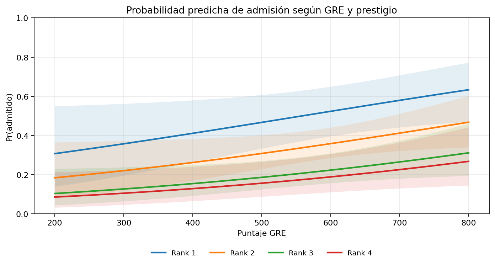
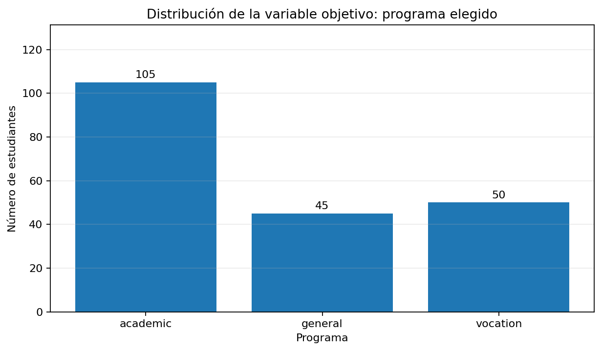
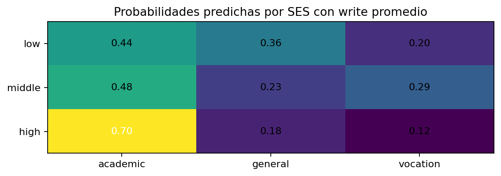
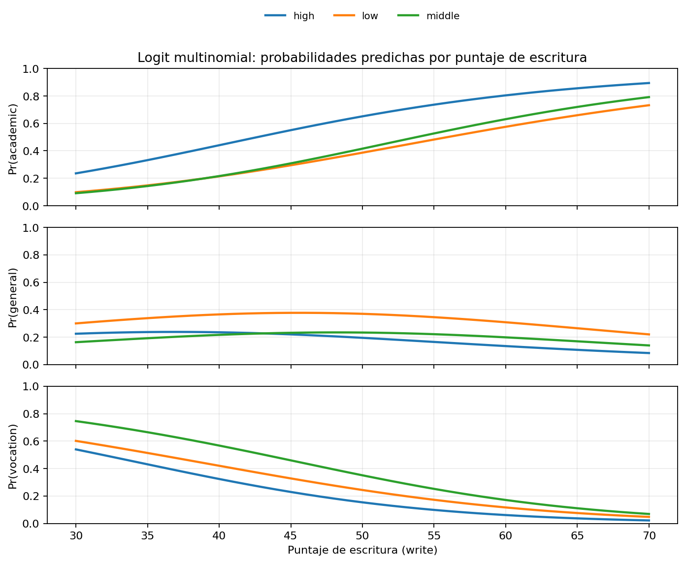
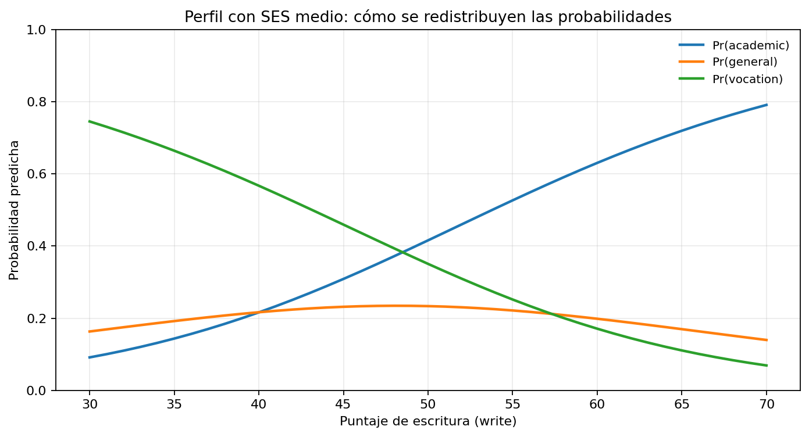
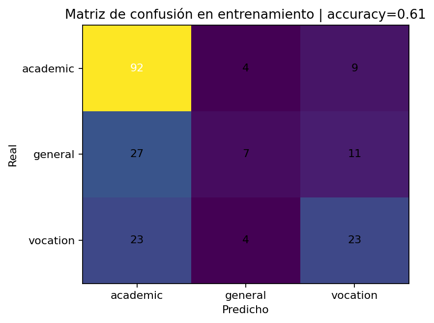

```{r setup, include=FALSE}
library(knitr)
library(tidyverse)
library(foreign)
library(nnet)
library(reshape2)
library(ResourceSelection)
library(marginaleffects)
library(scales)
library(fontawesome)

knitr::opts_chunk$set(
  echo = FALSE,
  dpi = 300,
  warning = FALSE,
  message = FALSE,
  error = FALSE,
  fig.align = "center",
  out.width = "70%"
)
options(htmltools.dir.version = FALSE)
set.seed(123)
```

class: inverse, left, bottom
background-image: url("img/fondo.jpg")
background-size: cover

# **`r rmarkdown::metadata$title`**
----

## **`r rmarkdown::metadata$subtitle`**

### `r rmarkdown::metadata$author`
### `r rmarkdown::metadata$date`

```{r xaringanExtra-share-again, echo=FALSE}
xaringanExtra::use_share_again()
```

```{r xaringanExtra-clipboard, echo=FALSE}
xaringanExtra::use_clipboard()
```

```{r xaringanExtra, echo=FALSE}
xaringanExtra::use_xaringan_extra("tile_view")
```

---

class: center, middle, inverse

# Ruta de la sesión de hoy

## Tipo de respuesta → Logit → Multinomial → interpretación → decisión

<br>

.orange[Logit será corto. El foco principal de la clase está en entender y usar bien el modelo multinomial.]

---

# Objetivos de aprendizaje

Al terminar la sesión deberíamos poder:

--

- distinguir entre una variable **binaria, nominal y ordinal**;
- interpretar un Logit sin confundir **coeficientes, odds y probabilidades**;
- formular un **Logit Multinomial** con una categoría base clara;
- interpretar coeficientes, **odds ratios, probabilidades predichas y efectos marginales**;
- transformar los resultados en una **decisión aplicada**.

--

.center[
.orange[La meta no es memorizar fórmulas: es saber qué cambia en la probabilidad de elegir cada alternativa.]
]

---

# ¿Qué tipo de variable dependiente tengo?

| Tipo de respuesta | Ejemplo | Modelo habitual |
|---|---|---|
| Binaria | compra / no compra | Logit o Probit |
| Nominal | débito / crédito / fintech | Logit Multinomial |
| Ordinal | riesgo bajo / medio / alto | Logit o Probit ordinal |

--

### La diferencia clave

- `incumple = sí/no` → dos categorías → **binario**.
- `canal = oficina/app/call center` → tres categorías sin orden → **multinomial**.
- `riesgo = bajo/medio/alto` → tres categorías ordenadas → **ordinal**.

.center[
.orange[La estructura de Y define la familia del modelo.]
]

---

# Ejemplos de negocio y gestión

| Decisión | Y | X posibles |
|---|---|---|
| Crédito | aprueba / no aprueba | score, ingreso, historial, deuda |
| Método de pago | débito / crédito / fintech | edad, ingreso, cashback, comisión |
| Producto financiero | básico / premium / pyme | tarifa, uso, saldo, canal |
| Programa académico | academic / general / vocation | write, SES, colegio previo |
| Canal de atención | oficina / app / call center | edad, distancia, urgencia, costo |

--

.center[
.orange[Primero definimos la decisión. Después pensamos en el modelo.]
]

---

class: center, middle, inverse

# Parte 1
## Logit binario: lo necesario para interpretar

---

# Logit binario: la idea mínima

Sea `Y = 1` cuando ocurre el evento de interés.

$$
p_i=P(Y_i=1\mid X_i)=\frac{1}{1+e^{-X_i'\beta}}
$$

Equivalentemente:

$$
\log\left(\frac{p_i}{1-p_i}\right)=X_i'\beta
$$

--

### ¿Qué hace el modelo?

Toma una combinación lineal de variables y la transforma en una **probabilidad entre 0 y 1**.

.orange[Los coeficientes viven en log-odds; para comunicar resultados normalmente tendremos que traducirlos.]

---

# ¿Por qué no quedarnos con regresión lineal?

Con una respuesta 0/1, el modelo lineal de probabilidad puede servir como aproximación.

Pero tiene límites:

- puede predecir probabilidades menores que 0 o mayores que 1;
- supone un efecto marginal constante en todo el rango;
- aparece heterocedasticidad por construcción;
- una relación probabilística suele ser naturalmente no lineal.

--

.center[
.orange[En Logit, mover X no genera el mismo cambio en probabilidad para todos los individuos.]
]

---

# Ejemplo: admisión a posgrado

Queremos explicar la probabilidad de admisión usando:

- `gre`: puntaje GRE;
- `gpa`: promedio académico;
- `rank`: prestigio de la institución de pregrado.

La respuesta es `admit = 1/0`.

```{r, echo=TRUE, eval=FALSE}
mydata <- read.csv("Datos/binary.csv")
mydata$rank <- factor(mydata$rank)

mylogit <- glm(admit ~ gre + gpa + rank,
               data = mydata,
               family = "binomial")
```

.orange[Como `rank` es factor, R compara rank 2, 3 y 4 contra rank 1.]

---

# Resultados Logit: ¿cómo los leo?

| Variable | Coeficiente | OR | p-valor |
|---|---:|---:|---:|
| GRE | 0.0023 | 1.002 | 0.038 |
| GPA | 0.8040 | 2.235 | 0.015 |
| Rank 2 vs 1 | -0.675 | 0.509 | 0.033 |
| Rank 3 vs 1 | -1.340 | 0.262 | <0.001 |
| Rank 4 vs 1 | -1.551 | 0.212 | <0.001 |

--

### GPA

`β = 0.804` implica `OR = exp(0.804) ≈ 2.23`.

Manteniendo lo demás constante, **las odds de admisión se multiplican por 2.23** por cada unidad adicional de GPA.

.orange[No significa que la probabilidad aumente 2.23 veces.]

---

# ¿Cómo leo una variable categórica?

Para `rank 4`:

$$\beta=-1.551, \qquad OR=e^{-1.551}\approx0.212$$

--

### Interpretación

Manteniendo GRE y GPA constantes, un estudiante proveniente de una institución `rank 4` tiene odds de admisión aproximadamente **79% menores** que uno de `rank 1`.

--

### Regla

`rank 4` no se compara con `rank 3`.

Se compara con la **categoría base: rank 1**.

---

# Probabilidades predichas: la lectura más clara

Con GRE y GPA en sus valores medios:

| Rank | Pr(admitido) |
|---|---:|
| 1 | 0.52 |
| 2 | 0.35 |
| 3 | 0.22 |
| 4 | 0.18 |

.pull-left[

### Interpretación

Para un perfil promedio, el modelo estima cerca de **52%** de admisión en rank 1 y **18%** en rank 4.

]

.pull-right[

```{r logit-plot, echo=FALSE, out.width="70%"}

```

]

---

# Diagnóstico y comparación rápida

### Hosmer-Lemeshow

```{r, echo=TRUE, eval=FALSE}
library(ResourceSelection)
hoslem.test(mylogit$y, fitted(mylogit))
```

No rechazar H0 indica que **no aparece evidencia clara de mal ajuste** bajo esta prueba.

No significa que el modelo sea perfecto.

--

### ¿Logit o Probit?

Ambos sirven para Y binaria y suelen producir historias sustantivas parecidas.

En esta clase no nos detendremos en esa comparación.

---

# Efectos marginales

Los efectos marginales traducen el modelo a **cambios en probabilidad**.

```{r, echo=TRUE, eval=FALSE}
library(marginaleffects)
avg_slopes(mylogit)
```

--

Si un efecto marginal promedio fuera `0.03`:

> un aumento de una unidad en X se asociaría, en promedio, con un aumento de **3 puntos porcentuales** en la probabilidad del evento.

--

.center[
.orange[Odds ratio y efecto marginal responden preguntas distintas.]
]

---

class: center, middle, inverse

# Parte 2
## Logit Multinomial: el centro de la clase

---

# ¿Qué cambia cuando hay más de dos opciones?

Ahora Y puede ser:

.center[
.font150[`academic / general / vocation`]
]

No hay una sola probabilidad.

Hay un vector:

$$P(Y=j\mid X),\qquad j=1,2,\dots,J$$

que cumple:

$$\sum_j P(Y=j\mid X)=1$$

--

.center[
.orange[Cuando una alternativa gana probabilidad, alguna otra debe perderla.]
]

---

# Intuición y fórmula del multinomial

Cada individuo asigna una utilidad latente a cada alternativa:

$$U_{ij}=X_i'\beta_j+\varepsilon_{ij}$$

Elige la alternativa con mayor utilidad.

--

El Logit Multinomial genera:

$$
P(Y_i=j\mid X_i)=
\frac{\exp(X_i'\beta_j)}
{\sum_h\exp(X_i'\beta_h)}
$$

### Resultado

Cada probabilidad está entre 0 y 1 y todas suman 1.

---

# La categoría base es fundamental

En nuestro ejemplo usamos:

.center[
.font160[**Base = academic**]
]

Entonces estimamos dos comparaciones:

$$\log\frac{P(general)}{P(academic)}=X\beta_{general}$$

$$\log\frac{P(vocation)}{P(academic)}=X\beta_{vocation}$$

--

.orange[Los coeficientes no son absolutos: siempre se interpretan respecto a la base.]

---

# Datos del ejemplo multinomial

Trabajaremos con **200 estudiantes**.

La variable dependiente `prog` contiene:

- `academic`: 105;
- `general`: 45;
- `vocation`: 50.

Predictores:

- `write`: puntuación de escritura;
- `ses`: `low`, `middle`, `high`.


---

# Datos del ejemplo multinomial

```{r mnl-dist, echo=FALSE, out.width="70%"}

```

---

# Estimación en R

```{r, echo=TRUE, eval=FALSE}
library(foreign)
library(nnet)

ml <- read.dta("Datos/hsb.dta")
ml$prog2 <- relevel(ml$prog, ref = "academic")

test <- multinom(prog2 ~ ses + write, data = ml)
summary(test)
```

--

### ¿Qué entrega?

Dos ecuaciones estimadas simultáneamente:

- `general vs academic`;
- `vocation vs academic`.

.orange[No son dos modelos binarios independientes.]

---

# Resultados principales

| Predictor | General vs Academic | p | Vocation vs Academic | p |
|---|---:|---:|---:|---:|
| write | -0.0579 | 0.0068 | -0.1136 | <0.001 |
| SES middle vs low | -0.5333 | 0.229 | 0.2914 | 0.541 |
| SES high vs low | -1.1628 | 0.024 | -0.9827 | 0.099 |

--

### Primera lectura

`write` aparece negativo en ambas ecuaciones.

Al aumentar `write`, **general y vocation pierden peso relativo frente a academic**.

---

# Interpretación detallada de write

### General vs Academic

$$\beta_{write}=-0.0579$$

Un punto adicional en `write` reduce los log-odds de estar en `general` frente a `academic` en aproximadamente **0.058**.

--

### Vocation vs Academic

$$\beta_{write}=-0.1136$$

El efecto relativo es aún más fuerte contra `vocation`.

--

.center[
.orange[El signo negativo no significa que write “baje todas las probabilidades”; significa que empuja la elección hacia academic.]
]

---

# Odds ratios y SES

### write

- `general vs academic`: `OR = 0.944` → las odds relativas caen alrededor de **5.6%** por punto.
- `vocation vs academic`: `OR = 0.893` → caen alrededor de **10.7%** por punto.

--

### SES high vs low: general vs academic

$$\beta=-1.163,\qquad OR=0.313$$

Manteniendo `write` constante, las odds relativas de `general` frente a `academic` son aproximadamente **68.7% menores** para SES alto que para SES bajo.

---

# No todo signo se convierte en conclusión

Para `SES middle vs low`:

- el coeficiente es negativo en `general vs academic`;
- es positivo en `vocation vs academic`;
- **ninguno es estadísticamente significativo**.

--

### Evitar

“SES medio aumenta la elección vocacional”.

### Mejor

“La estimación puntual es positiva, pero la evidencia estadística no permite afirmar con claridad una diferencia frente al SES bajo.”

--

.orange[Interpretar = signo + magnitud + incertidumbre + contexto.]

---

# Probabilidades predichas por SES

Manteniendo `write` en su media:

| SES | Academic | General | Vocation |
|---|---:|---:|---:|
| Low | 0.440 | 0.358 | 0.202 |
| Middle | 0.478 | 0.228 | 0.294 |
| High | 0.701 | 0.178 | 0.121 |

.pull-left[

### Lectura

Para `write` promedio, SES alto tiene una probabilidad estimada de `academic` cercana al **70%**, frente a **44%** en SES bajo.

]

.pull-right[

```{r mnl-ses, echo=FALSE, out.width="70%"}

```

]

---

# ¿Qué ocurre cuando cambia write?

Ahora dejamos variar `write` y calculamos, para cada perfil:

$$P(academic),\;P(general),\;P(vocation)$$


.pull-left[

### Lectura central

Al aumentar `write`, sube la probabilidad de `academic`, cae con fuerza `vocation` y `general` cambia menos.

]

.pull-right[

```{r mnl-write, echo=FALSE, out.width="80%"}

```


]


---

# Un perfil concreto: SES medio

```{r mnl-middle, echo=FALSE, out.width="70%"}

```


---

# Un perfil concreto: SES medio

### ¿Por qué sirve?

Porque convierte un conjunto de coeficientes en una pregunta cercana a gestión:

> para un estudiante con estas características, ¿cómo se distribuye la probabilidad entre las tres alternativas?

--

.orange[En aplicaciones reales, los perfiles y escenarios suelen comunicar mejor que una tabla de β.]

---

# Efectos marginales promedio

| Outcome | write | SES middle vs low | SES high vs low |
|---|---:|---:|---:|
| Academic | +0.0171 | +0.029 | +0.219 |
| General | -0.0028 | -0.108 | -0.136 |
| Vocation | -0.0143 | +0.078 | -0.083 |

--

### Ahora sí hablamos de probabilidad

Average Marginal Effects: Resumen cuánto cambia, **en promedio**, la probabilidad de cada alternativa cuando cambia un predictor.

.center[
.orange[En multinomial, los efectos sobre las distintas categorías se compensan porque las probabilidades suman 1.]
]

---

# Interpretación de los efectos de write

### Academic

AME = **+0.0171**, p < 0.001.

Un punto adicional en `write` aumenta, en promedio, la probabilidad de `academic` en cerca de **1.7 puntos porcentuales**.

--

### Vocation

AME = **-0.0143**, p < 0.001.

Un punto adicional reduce la probabilidad de `vocation` en cerca de **1.4 puntos porcentuales**.

--

### General

AME ≈ -0.0028, p ≈ 0.317: efecto pequeño y sin evidencia estadística clara.

---

# Interpretación de SES high

Para `academic`:

$$AME\approx +0.219, \qquad p\approx0.011$$

--

### Lectura correcta

Comparado con SES bajo, pertenecer a SES alto se asocia, en promedio, con una probabilidad de `academic` aproximadamente **21.9 puntos porcentuales mayor**, manteniendo el resto del modelo.

--

.orange[Esto es probabilidad. No debemos describir 0.219 como “unidades en escala logit”.]

---

# Validación: matriz de confusión

.pull-left[

```{r mnl-confusion, echo=FALSE, out.width="70%"}

```

]

.pull-right[

### Accuracy ≈ 61%

- El modelo clasifica mejor `academic`, que además es la categoría más frecuente.
- `general` es la categoría más difícil de distinguir.
- La matriz resume una clasificación dura, pero no reemplaza las probabilidades predichas.

]

--

.orange[Una métrica global puede esconder que unas categorías funcionan mucho mejor que otras.]

---

# Medidas de ajuste

| Medida | Valor aprox. | Lectura |
|---|---:|---|
| Log-likelihood | -179.98 | mayor es mejor al comparar especificaciones |
| LL nulo | -204.10 | modelo sin predictores |
| Pseudo-R² | 0.118 | mejora frente al nulo; no es R² lineal |
| AIC | 375.96 | menor es mejor al comparar modelos |

--

### Idea práctica

Estas medidas sirven para comparar una especificación base contra otra más rica.

No reemplazan la pregunta sustantiva ni la lectura de probabilidades.

---

# Supuesto IIA

El Logit Multinomial supone **independencia de alternativas irrelevantes**.

En términos simples:

> la razón de probabilidades entre dos alternativas no debería distorsionarse porque aparezca una tercera alternativa casi idéntica.

--

### Ejemplo

Bus / taxi / metro.

Si aparece una segunda línea de metro casi idéntica, probablemente “robe” sobre todo probabilidad al metro original.

### Para el taller

Pregunten: ¿hay alternativas casi clones?, ¿son realmente excluyentes?, ¿hay una jerarquía natural?

---

# Pipeline práctico para un MNL

1. **Pregunta:** decisión y alternativas nominales.
2. **Datos:** fuente, diccionario, limpieza y frecuencias.
3. **Modelo:** categoría base + especificación.
4. **Resultados:** coeficientes, OR y significancia.
5. **Interpretación:** probabilidades predichas + efectos marginales.
6. **Validación:** matriz de confusión + AIC / pseudo-R².
7. **Decisión:** escenario y recomendación basada en probabilidades.

--

.center[
.orange[El informe debe terminar en una decisión, no en `summary(modelo)`.]
]

---

# Código mínimo para el taller

```{r, echo=TRUE, eval=FALSE}
library(nnet)
library(marginaleffects)

base$y <- relevel(factor(base$y),
                  ref = "categoria_base")

modelo <- multinom(y ~ x1 + x2 + x3,
                   data = base)

summary(modelo)
exp(coef(modelo))
avg_slopes(modelo)
predict(modelo, newdata = perfiles, type = "probs")
```

.orange[El código es corto. La parte importante es justificar e interpretar.]

---

# Plantilla de interpretación

### Coeficiente
“Frente a la categoría base, X aumenta/disminuye los log-odds de elegir j.”

### Odds ratio
“Las odds relativas de j frente a la base se multiplican por ...”

### Probabilidad predicha
“Para este perfil, las probabilidades estimadas son A = ..., B = ... y C = ...”

### Decisión
“Bajo el escenario propuesto, la mayor redistribución de probabilidad ocurre desde ... hacia ...”

--

.center[
.orange[Esta secuencia evita quedarse en una interpretación puramente técnica.]
]

---


class: inverse, center, middle
background-color: #122140

.pull-left[

.center[
<br><br>

# Gracias!!!

<br>

### ¿Preguntas?

<br>

```{r, echo=FALSE, fig.align="center", out.width="49%"}
knitr::include_graphics("img/qr-code.png")
```

]

]

.pull-right[

<br><br>


### [www.joaquibarandica.com](https://www.joaquibarandica.com)

orlando.joaqui@correounivalle.edu.co


]

<br><br><br>
