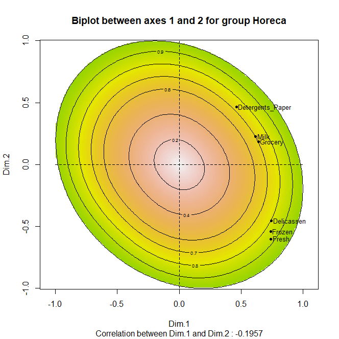
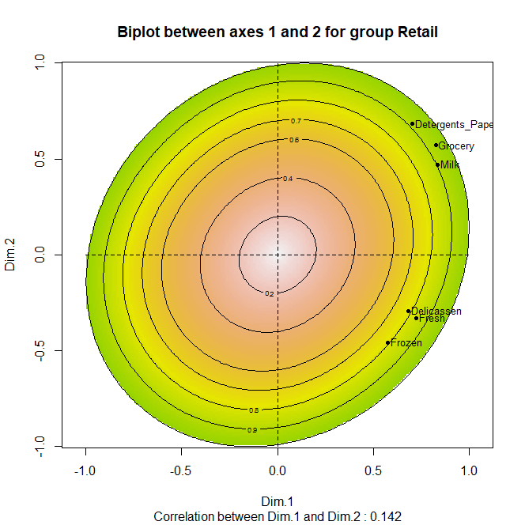

```{r setup, include = FALSE}
library(knitr)
library(tidyverse)
library(FactoMineR)
library(factoextra)
library(scales)
library(fontawesome)

knitr::opts_chunk$set(echo = FALSE,
                      dpi = 300,
                      warning = FALSE,
                      message = FALSE,
                      error = FALSE,
                      fig.align = "center")

options(htmltools.dir.version = FALSE)
```

class: inverse, left, bottom
background-image: url("img/fondo.jpg")
background-size: cover

# **`r rmarkdown::metadata$title`**
----

## **`r rmarkdown::metadata$subtitle`**

### `r rmarkdown::metadata$author`
### `r rmarkdown::metadata$date`

```{r xaringanExtra-share-again, echo=FALSE}
 xaringanExtra::use_share_again()
```

```{r xaringanExtra-clipboard, echo=FALSE}
 xaringanExtra::use_clipboard()
```

```{r xaringanExtra, echo=FALSE}
xaringanExtra::use_xaringan_extra("tile_view")
```

---

class: center, middle, inverse

# Ruta de la sesión de hoy

## ACP → lectura de ejes → ACP Dual → grupos → decisión

<br>

.orange[La idea no es aprender otra función de R, sino aprender a leer cuándo una estructura global cambia entre grupos.]

---

# ¿Dónde quedamos?

En clases anteriores hemos usado modelos para explicar o predecir una variable de interés.

--

Hoy la lógica cambia.

### Antes:
¿Cuál variable explica mejor una respuesta?

### Ahora:
¿Cómo puedo resumir muchas variables al mismo tiempo y leer patrones generales?

--

.center[
.orange[ACP y ACP Dual sirven cuando la información está repartida entre muchas variables.]
]

---

# Pregunta de arranque

Supongamos que una empresa mayorista conoce el gasto anual de sus clientes en varias categorías:

- productos frescos,
- leche,
- abarrotes,
- congelados,
- detergentes y papel,
- delicatessen.

--

### Pregunta inicial
¿Podemos resumir estos seis gastos en dos o tres dimensiones fáciles de interpretar?

--

### Segunda pregunta
¿La estructura de gasto es la misma para todos los canales comerciales?

.center[
.orange[La segunda pregunta es la que nos lleva al ACP Dual.]
]

---

class: center, middle, inverse

# Primero: recordemos ACP
## Lo suficiente para leer bien la clase

---

# ¿Para qué sirve el ACP?

ACP significa **Análisis de Componentes Principales**.

En palabras sencillas, toma varias variables numéricas que pueden estar relacionadas entre sí y construye unas variables nuevas llamadas **componentes** o **dimensiones**.

--

### La idea práctica

Si tengo seis variables de gasto, quizás dos dimensiones capturan buena parte de la información.

ACP no elimina información al azar: intenta conservar la mayor variabilidad posible.

--

.center[
.orange[ACP transforma muchas variables correlacionadas en pocas dimensiones no correlacionadas.]
]

---

# ¿Qué es una dimensión?

Una dimensión del ACP es una mezcla de las variables originales.

--

### Ejemplo intuitivo

Una dimensión podría representar:

- gasto general alto vs. bajo,
- clientes más orientados a abarrotes vs. frescos,
- clientes con consumo especializado vs. consumo básico.

--

### Importante

La dimensión no viene con nombre.

.center[
.orange[El nombre lo ponemos nosotros después de mirar qué variables la construyen.]
]

---

# Eigenvalue y varianza explicada

### Eigenvalue o valor propio

Es la cantidad de información que captura una dimensión.

Si una dimensión tiene un eigenvalue alto, resume bastante variabilidad de los datos.

--

### Varianza explicada

Es el porcentaje de información total que queda resumido en cada dimensión.

Ejemplo: si Dim.1 explica 45% y Dim.2 explica 25%, el plano Dim.1–Dim.2 explica 70%.

--

.center[
.orange[No necesitamos memorizar la fórmula. Necesitamos leer cuánto informa cada dimensión.]
]

---

# Contribución y cos²

.pull-left[

### Contribución

Pregunta:

**¿Quién construye la dimensión?**

Sirve para nombrar Dim.1, Dim.2, etc.

Una variable con alta contribución es importante para interpretar el eje.

]

.pull-right[

### Cos²

Pregunta:

**¿Qué tan bien se ve este punto en el plano?**

Sirve para saber si conviene interpretar una variable o individuo en las dimensiones mostradas.

]

--

.center[
.orange[Contribución dice importancia para el eje. Cos² dice calidad de representación.]
]

---

# Cómo leer un gráfico de variables

### Variables cercanas
Se mueven de manera parecida.

### Variables en lados opuestos
Tienden a representar patrones contrarios sobre el eje.

### Variables largas y alejadas del centro
Están mejor representadas en el plano.

### Color por contribución
Variables con mayor contribución ayudan más a construir los ejes.

.center[
.orange[La interpretación del ACP empieza mirando variables, no individuos.]
]

---

class: center, middle, inverse

# Base de trabajo
## Clientes mayoristas y patrones de gasto

---

# Vamos a usar un solo ejemplo

Trabajaremos con una base didáctica de **clientes mayoristas**.

Cada fila es un cliente.

--

### Variables cuantitativas activas

`Fresh`, `Milk`, `Grocery`, `Frozen`, `Detergents_Paper`, `Delicassen`.

--

### Variables cualitativas

- `Canal`: grupo principal para comparar.
- `Region`: variable suplementaria para acompañar la lectura.

.center[
.orange[La clase usa una sola historia: patrones de gasto, estructura global y comparación entre canales.]
]

---

# Cargar datos

```{r cargar_datos, echo=TRUE}
library(tidyverse)
library(FactoMineR)
library(factoextra)
library(scales)

clientes <- read_csv(
  "Datos/clientes_mayoristas_demo.csv",
  show_col_types = FALSE
) %>%
  mutate(
    Region = factor(Region),
    Canal = factor(Canal)
  )

glimpse(clientes)
```

---

# Variables activas y descriptivo inicial

```{r variables_descriptivo, echo=TRUE}
vars_gasto <- c(
  "Fresh", "Milk", "Grocery", "Frozen",
  "Detergents_Paper", "Delicassen"
)

clientes %>%
  group_by(Canal) %>%
  summarise(
    n = n(),
    across(all_of(vars_gasto), mean),
    .groups = "drop"
  )
```

--

### Lectura

Si los promedios cambian entre canales, tiene sentido preguntarse si la estructura multivariada también cambia.

---

# Distribución de las variables

```{r boxplot_gastos, fig.width=10.5, fig.height=5.2, out.width="75%"}
clientes %>%
  select(all_of(vars_gasto)) %>%
  pivot_longer(everything(), names_to = "variable", values_to = "valor") %>%
  ggplot(aes(x = variable, y = valor)) +
  geom_boxplot(fill = "#D55E00", alpha = 0.35) +
  scale_y_continuous(labels = comma) +
  labs(title = "Distribución de gasto anual por categoría", x = NULL, y = "Gasto anual") +
  theme_minimal(base_size = 13) +
  theme(axis.text.x = element_text(angle = 30, hjust = 1))
```

---

# ¿Por qué estandarizar?

Las variables están en unidades parecidas, pero no necesariamente tienen la misma escala.

Si una variable tiene valores muy grandes o muy dispersos, podría dominar el ACP solo por escala.

--

### Estandarizar significa

Convertir cada variable para que tenga:

- media 0;
- desviación estándar 1.

--

.center[
.orange[Así el ACP compara patrones y no solamente tamaños.]
]

---

class: center, middle, inverse

# ACP global
## La estructura promedio de todos los clientes

---

# Ejecutar el ACP

```{r pca_modelo, echo=TRUE}
res.pca <- PCA(
  clientes %>% select(all_of(vars_gasto)),
  scale.unit = TRUE,
  graph = FALSE
)
```

--

### Qué hicimos

- Tomamos seis variables cuantitativas.
- Las estandarizamos.
- Construimos dimensiones principales.
- Guardamos el resultado en `res.pca`.

---

# Varianza explicada

```{r pca_eigen, echo=TRUE}
res.pca$eig
```

--

### Cómo leer la tabla

- `eigenvalue`: información capturada por cada dimensión.
- `% of variance`: porcentaje explicado por esa dimensión.
- `cumulative % of variance`: porcentaje acumulado hasta esa dimensión.

.center[
.orange[La primera decisión es cuántas dimensiones vale la pena mirar.]
]

---

# Scree plot

```{r pca_scree, fig.width=9.5, fig.height=5.2, out.width="60%"}
fviz_eig(res.pca, addlabels = TRUE)
```

### Qué mirar

Altura de las barras, caída entre dimensiones y porcentaje acumulado.

.center[
.orange[El ACP resume; no pretende contar absolutamente todo en dos ejes.]
]

---

# Resultados de las variables

```{r pca_variables_resultados, echo=TRUE}
res.var <- get_pca_var(res.pca)

res.var$coord      # coordenadas de las variables
res.var$contrib    # contribuciones
res.var$cos2       # calidad de representación
```

---

# Resultados de las variables

### Traducción

- `coord`: dónde cae cada variable en el plano.
- `contrib`: cuánto ayudó a construir cada dimensión.
- `cos2`: qué tan bien se representa en las dimensiones.

---

# Gráfico de variables

```{r pca_var_plot, fig.width=9.5, fig.height=5.3, out.width="60%"}
fviz_pca_var(
  res.pca,
  col.var = "contrib",
  gradient.cols = c("#00AFBB", "#E7B800", "#D55E00"),
  repel = TRUE
)
```

### Lectura

Variables cercanas se mueven juntas. Variables opuestas diferencian perfiles. Variables alejadas del centro son más interpretables.

---

# Contribuciones a Dim.1 y Dim.2

.pull-left[
```{r contrib_dim1, fig.width=5.1, fig.height=4.1, out.width="100%"}
fviz_contrib(res.pca, choice = "var", axes = 1, top = 10)
```
]

.pull-right[
```{r contrib_dim2, fig.width=5.1, fig.height=4.1, out.width="100%"}
fviz_contrib(res.pca, choice = "var", axes = 2, top = 10)
```
]

---

# Cómo nombrar las dimensiones

Miro las variables que más contribuyen a cada dimensión.

--

### Si aparecen `Grocery`, `Milk` y `Detergents_Paper`

Podríamos leer la dimensión como un patrón de compras más asociado a abastecimiento comercial o minorista.

--

### Si aparecen `Fresh`, `Frozen` o `Delicassen`

Podría indicar una dimensión más asociada a consumo de alimentos frescos, preparación de comidas o consumo especializado.

.center[
.orange[El nombre de una dimensión se justifica con variables, no con intuición suelta.]
]

---

# Individuos en el ACP

```{r pca_ind_plot, fig.width=9.5, fig.height=5.3, out.width="60%"}
fviz_pca_ind(
  res.pca,
  geom.ind = "point",
  col.ind = clientes$Canal,
  palette = c("#0072B2", "#D55E00"),
  addEllipses = TRUE,
  legend.title = "Canal"
)
```

### Lectura

Puntos cercanos = perfiles de gasto parecidos. Puntos alejados = perfiles distintos.

---

# Biplot: individuos y variables juntos

```{r pca_biplot, fig.width=10.2, fig.height=5.6,          out.width="60%"}
fviz_pca_biplot(
  res.pca,
  geom.ind = "point",
  col.ind = clientes$Canal,
  palette = c("#0072B2", "#D55E00"),
  col.var = "black",
  addEllipses = TRUE,
  repel = TRUE,
  legend.title = "Canal"
)
```

### Lectura

Si un cliente cae hacia una variable, su perfil tiende a estar asociado con valores altos en esa variable.

---

class: center, middle, inverse

# La limitación del ACP global
## ¿Promedio de estructuras o estructura por grupos?

---

# ¿Qué no responde el ACP global?

El ACP global nos dice cómo se organizan las variables en toda la muestra.

Pero no responde completamente esta pregunta:

.center[
.font140[
¿Las variables se relacionan igual dentro de cada canal?
]
]

--

### Ejemplo

`Grocery` puede ser central en Retail, pero no tener el mismo papel en Horeca.

.center[
.orange[El ACP global puede ocultar diferencias estructurales entre grupos.]
]

---

# Aquí aparece el ACP Dual

ACP Dual se usa cuando tenemos:

- individuos descritos por variables cuantitativas;
- una variable cualitativa que define grupos;
- interés en comparar la estructura de las variables entre esos grupos.

--

### En nuestro caso

- individuos: clientes;
- variables: categorías de gasto;
- grupo: canal comercial.

.center[
.orange[La estrella de la clase no es reducir dimensiones; es comparar estructuras.]
]

---

# ACP vs. ACP Dual

| Pregunta | ACP | ACP Dual |
|---|---:|---:|
| ¿Resume muchas variables? | Sí | Sí |
| ¿Construye dimensiones principales? | Sí | Sí |
| ¿Mira individuos y variables? | Sí | Sí |
| ¿Usa un grupo conocido como parte central del análisis? | No | Sí |
| ¿Permite comparar el papel de las variables entre grupos? | No directamente | Sí |

.center[
.orange[ACP pregunta: ¿cómo se organiza la información? ACP Dual pregunta: ¿esa organización cambia entre grupos?]
]

---

# La intuición del Dual

.center[
.font150[
ACP global = una estructura común.
]
]

<br>

.center[
.font150[
ACP Dual = estructura común + lectura por grupo.
]
]

--

### Traducción

Una variable puede tener una posición global y varias posiciones parciales, una por grupo.

Si esas posiciones parciales se separan, la variable no juega el mismo papel en todos los grupos.

---

# Qué buscamos en el Dual

### Si las posiciones parciales son cercanas

La variable juega un papel parecido en los grupos.

### Si las posiciones parciales se separan mucho

La variable no tiene el mismo papel en todos los grupos.

### Si un grupo se aleja de otro

La estructura multivariada del grupo puede ser distinta.

.center[
.orange[El Dual no solo pregunta quién compra más, sino cómo se organizan las compras dentro de cada grupo.]
]

---

class: center, middle, inverse

# ACP Dual en R
## Estructura de datos y ejecución

---

# Preparar la base dual

```{r preparar_dual, echo=TRUE}
base_dual <- clientes %>%
  select(
    Region,      # cualitativa suplementaria
    Canal,       # factor que define los grupos
    all_of(vars_gasto)
  )

head(base_dual)
```


Columna 1 = `Region`, suplementaria. Columna 2 = `Canal`, factor de agrupación. Columnas 3 a 8 = variables cuantitativas activas.

---

# Ejecutar ACP Dual

```{r ejecutar_dual, echo=TRUE}
res.dual <- DMFA(
  base_dual,
  num.fact = 2,
  quali.sup = 1,
  scale.unit = TRUE,
  graph = FALSE
)
```

### Lectura de los argumentos

- `num.fact = 2`: la columna 2 define los grupos.
- `quali.sup = 1`: la columna 1 acompaña la interpretación.
- `scale.unit = TRUE`: estandariza las variables cuantitativas.

---

# Cuidado con `num.fact`

`num.fact = 2` no significa que quiero dos factores.

--

Significa:

.center[
.font150[
la variable que define los grupos está en la columna 2.
]
]

--

En nuestro caso, la columna 2 es `Canal`.

.center[
.orange[Esta es una de las confusiones más comunes al usar DMFA.]
]

---

# Varianza explicada en el Dual

```{r dual_eig, echo=TRUE}
res.dual$eig
```

### Qué miro

Igual que en ACP: cuánto explica Dim.1, cuánto explica Dim.2 y cuánto acumulan juntas.

### Qué cambia

Ahora esas dimensiones se construyen teniendo en cuenta la estructura dual definida por el factor de grupo.

---

# Variables globales del Dual

```{r dual_var_global, echo=TRUE}
res.dual$var$coord
res.dual$var$contrib
res.dual$var$cos2
```


---

# Variables globales del Dual

### Lectura

Esto se parece mucho al ACP: coordenadas, contribuciones y calidad de representación.

.center[
.orange[La lectura global se conserva, pero todavía no hemos llegado a lo más importante.]
]

---

# Gráfico de individuos en el Dual

```{r dual_ind, fig.width=9.5, fig.height=5.2, out.width="60%"}
plot(
  res.dual,
  choix = "ind",
  invisible = "quali",
  label = "none",
  title = "ACP Dual: individuos"
)
```

### Qué observar

Si los clientes de un canal se agrupan, si hay mezcla entre canales, si aparecen individuos extremos o si algún grupo queda más disperso.

---

# Gráfico de variables en el Dual

```{r dual_var_plot, fig.width=9.5, fig.height=5.2, out.width="80%"}
# Coordenadas globales
var_global <- as.data.frame(res.dual$var$coord[, 1:2]) %>%
  tibble::rownames_to_column("Variable")

names(var_global)[2:3] <- c("Dim1", "Dim2")


# Coordenadas de las variables dentro de cada grupo
var_parcial <- purrr::imap_dfr(
  res.dual$var.partiel,
  function(tabla, grupo) {

    aux <- as.data.frame(tabla[, 1:2]) %>%
      tibble::rownames_to_column("Variable")

    names(aux)[2:3] <- c("Dim1", "Dim2")

    aux %>%
      mutate(Canal = grupo)
  }
)


# Porcentaje explicado
ve <- res.dual$eig[, 2]


ggplot() +

  geom_hline(
    yintercept = 0,
    linetype = "dashed"
  ) +

  geom_vline(
    xintercept = 0,
    linetype = "dashed"
  ) +

  # Flechas parciales: una por variable y por canal
  geom_segment(
    data = var_parcial,
    aes(
      x = 0,
      y = 0,
      xend = Dim1,
      yend = Dim2,
      color = Canal
    ),
    arrow = grid::arrow(length = grid::unit(0.12, "cm")),
    alpha = 0.55,
    linewidth = 0.7
  ) +

  # Flechas globales
  geom_segment(
    data = var_global,
    aes(
      x = 0,
      y = 0,
      xend = Dim1,
      yend = Dim2
    ),
    arrow = grid::arrow(length = grid::unit(0.16, "cm")),
    linewidth = 1
  ) +

  ggrepel::geom_text_repel(
    data = var_global,
    aes(
      x = Dim1,
      y = Dim2,
      label = Variable
    ),
    fontface = "bold",
    size = 4
  ) +

  coord_equal() +

  labs(
    title = "ACP Dual: variables globales y por canal",
    subtitle = "Flechas negras: estructura global | Colores: estructura dentro de cada canal",
    x = paste0("Dim.1 (", round(ve[1], 1), "%)"),
    y = paste0("Dim.2 (", round(ve[2], 1), "%)"),
    color = "Canal"
  ) +

  theme_minimal()

```


---

# Gráfico de variables en el Dual

### ¿Cómo leemos este gráfico?

Las **flechas negras** muestran la estructura global.  
Las **flechas de color** muestran cómo aparece cada variable dentro de **Horeca** y **Retail**.

- **Dim. 1 (48.2%)** recoge principalmente un nivel general de compra.
- **Dim. 2 (20.2%)** contrapone `Milk`, `Grocery` y `Detergents_Paper`
  frente a `Fresh`, `Frozen` y `Delicassen`.
- Retail presenta una asociación más marcada con `Milk`, `Grocery`
  y `Detergents_Paper`, mientras que Horeca se proyecta relativamente
  más hacia `Fresh` y `Frozen`.

.center[
.orange[La estructura general se conserva, pero el peso de algunas variables cambia según el canal. Si la flecha azul y la rosada de una variable quedan casi juntas, esa variable juega un papel parecido en ambos grupos. Si se separan, el DUAL nos está diciendo que su papel cambia según el grupo.]
]


---


---

# Biplots por canal

.pull-left[
.center[

]
]

.pull-right[
.center[

]
]

.center[
.orange[Ahora no miramos solo la estructura global: miramos cómo se comportan las variables dentro de cada canal.]
]

---

# ¿Cómo se leen estos gráficos?

Cada gráfico muestra la relación entre las variables y las dos primeras dimensiones, pero **separando por canal**.

- Los puntos cerca del borde están mejor representados por Dim. 1 y Dim. 2.
- Variables cercanas entre sí tienen comportamientos parecidos.
- Variables en direcciones opuestas ayudan a diferenciar perfiles.
- La Dim. 1 está asociada con un nivel general de compra.
- La Dim. 2 separa dos tipos de canasta.

.center[
**Arriba:** `Milk`, `Grocery`, `Detergents_Paper`  
**Abajo:** `Fresh`, `Frozen`, `Delicassen`
]

.orange[
La pregunta clave no es solo dónde cae cada variable, sino si esa estructura cambia entre Horeca y Retail.
]

---

# Interpretación: Horeca vs Retail

En ambos canales aparece una estructura común: todas las variables apuntan hacia la derecha, por lo que la **Dim. 1** resume una intensidad general de compra.

La **Dim. 2** separa dos perfiles de productos:

.pull-left[
### Horeca

`Milk`, `Grocery` y `Detergents_Paper` aparecen arriba.

`Fresh`, `Frozen` y `Delicassen` aparecen abajo.

La separación existe, pero es menos marcada.
]

.pull-right[
### Retail

La oposición es más clara.

`Detergents_Paper`, `Grocery` y `Milk` tienen una relación más fuerte con la parte positiva de Dim. 2.

`Fresh`, `Frozen` y `Delicassen` quedan en la dirección contraria.
]

.center[
.orange[
Conclusión: la estructura general se mantiene, pero Retail muestra con mayor fuerza la separación entre tipos de canasta.
]
]


---

# La salida clave: `var.partiel`

```{r dual_var_partiel, echo=TRUE}
res.dual$var.partiel
```


---

# La salida clave: `var.partiel`

### Qué contiene

Las coordenadas parciales de las variables por grupo.

### En lenguaje sencillo

Para cada variable, el Dual permite observar cómo se ubica dentro de cada canal.

.center[
.orange[Esta es la salida que convierte el ACP en una comparación entre estructuras.]
]

---

# Cómo interpretar `var.partiel`

Supongamos que miramos `Grocery`.

--

### Caso 1

`Grocery` tiene coordenadas parecidas en Retail y Horeca.

Lectura: su papel en la estructura es semejante entre canales.

--

### Caso 2

`Grocery` se ubica fuerte en Dim.1 para Retail, pero no para Horeca.

Lectura: esa variable organiza más un canal que otro.

.center[
.orange[No miramos solo el promedio de una variable, miramos su papel dentro de la estructura multivariada.]
]

---

# Gráfico de grupos

```{r dual_group, fig.width=9.5, fig.height=5.2, out.width="60%"}
plot(
  res.dual,
  choix = "group",
  label = "all",
  title = "ACP Dual: grupos"
)
```

### Lectura

Si los grupos están próximos, la estructura de variables es parecida. Si se separan, hay diferencias importantes en la forma como las variables organizan a los individuos.

---

# Variable suplementaria

```{r dual_quali, fig.width=9.5, fig.height=5.2, out.width="60%"}
plot(
  res.dual,
  choix = "quali",
  label = "all",
  title = "ACP Dual: variable suplementaria"
)
```


`Region` no construyó los ejes principales. Se proyecta para ayudar a interpretar.

.center[
.orange[La suplementaria acompaña la lectura; no define el análisis.]
]


---

# Variable suplementaria

### ¿Qué nos aporta `Region`?

`Region` **no construye las dimensiones**: se proyecta después sobre el espacio factorial
para ayudarnos a entender mejor los perfiles encontrados.

- **Bogotá** y **Medellín** aparecen en zonas opuestas del plano, lo que sugiere perfiles de compra diferentes.
- **Cali** se encuentra cerca del origen: las dos primeras dimensiones no la diferencian fuertemente del perfil promedio.
- Las posiciones **Horeca** y **Retail** no coinciden completamente dentro de cada región:
  el patrón regional también puede cambiar según el canal.

.center[
.orange[La variable suplementaria no modifica el mapa; nos ayuda a ponerle contexto al mapa.]
]


---

# Receta para interpretar ACP Dual

```text
1. Leer varianza explicada.
2. Nombrar Dim.1 y Dim.2 usando contribuciones.
3. Mirar individuos y grupos.
4. Revisar variables parciales con var.partiel.
5. Preguntar qué variable cambia de papel entre grupos.
6. Cerrar con una decisión.
```

--

.center[
.orange[Si no hay decisión, el análisis se queda en dibujo bonito.]
]

---

# Ejemplo de interpretación completa

Supongamos que Dim.1 está asociada con `Milk`, `Grocery` y `Detergents_Paper`.

--

Podemos decir:

> Dim.1 representa un patrón de compras orientado a abastecimiento comercial y productos de rotación.

--

Si Retail se ubica más fuerte en esa dirección:

> El canal Retail parece estar más conectado con ese patrón de compra.

--

Si `var.partiel` muestra que esas variables se separan por canal:

> El papel de esas categorías no es igual en todos los canales.

---

# Qué decisión podría tomar una empresa

Con ACP y Dual, la empresa podría decidir:

--

### 1. Diferenciar portafolios
No ofrecer el mismo paquete de productos a todos los canales.

### 2. Diseñar promociones por patrón
Promocionar categorías que caracterizan un grupo específico.

### 3. Segmentar clientes
Agrupar clientes a partir de sus coordenadas factoriales.

.center[
.orange[La técnica se justifica si cambia una decisión.]
]

---

class: center, middle, inverse

# Bonus aplicado
## Clusterización sobre factores

---

# ¿Por qué clusterizar sobre factores?

Podemos agrupar clientes usando las seis variables originales.

Pero si esas variables están correlacionadas, el clustering puede duplicar información.

--

### Alternativa

Primero usamos ACP para resumir la información.

Luego aplicamos clustering sobre las coordenadas factoriales.

.center[
.font130[
variables originales → ACP → coordenadas factoriales → clusters
]
]

---

# Coordenadas factoriales y k-means

```{r kmeans_factores, echo=TRUE}
coord_factores <- res.pca$ind$coord[, 1:3]

set.seed(123)

modelo_cluster <- kmeans(
  coord_factores,
  centers = 3,
  nstart = 25
)

clientes_cluster <- clientes %>%
  mutate(cluster = factor(modelo_cluster$cluster))
```

--

### Nota

Usamos 3 clusters como ejercicio aplicado. En un análisis formal, justificaríamos mejor el número de clusters.

---

# Ver clusters en el plano factorial

```{r cluster_plot, fig.width=9.5, fig.height=5.2, out.width="72%"}
fviz_pca_ind(
  res.pca,
  geom.ind = "point",
  col.ind = clientes_cluster$cluster,
  palette = c("#0072B2", "#D55E00", "#009E73"),
  addEllipses = TRUE,
  legend.title = "Cluster"
)
```

---

# Perfil promedio de los clusters

```{r perfil_cluster, echo=TRUE, fig.width=10.2, fig.height=5.1, out.width="76%"}
perfil_cluster <- clientes_cluster %>%
  group_by(cluster) %>%
  summarise(n = n(), across(all_of(vars_gasto), mean), .groups = "drop")

perfil_cluster

```


---

# Perfil promedio de los clusters

```{r perfil_cluster2, echo=TRUE, eval=FALSE, fig.width=10.2, fig.height=5.1, out.width="76%"}

perfil_cluster <- clientes_cluster %>%
  group_by(cluster) %>%
  summarise(n = n(), across(all_of(vars_gasto), mean), .groups = "drop")

perfil_cluster %>%
  pivot_longer(all_of(vars_gasto), names_to = "variable", values_to = "media") %>%
  ggplot(aes(x = variable, y = media, group = cluster, color = cluster)) +
  geom_line(linewidth = 1) +
  geom_point(size = 2) +
  scale_y_continuous(labels = comma) +
  labs(title = "Perfil promedio de gasto por cluster", x = NULL, y = "Gasto promedio") +
  theme_minimal(base_size = 13) +
  theme(axis.text.x = element_text(angle = 30, hjust = 1))
```


---

# Perfil promedio de los clusters

```{r perfil_cluster3, echo=FALSE, eval=TRUE, fig.width=10.2, fig.height=5.1, out.width="80%"}

perfil_cluster <- clientes_cluster %>%
  group_by(cluster) %>%
  summarise(n = n(), across(all_of(vars_gasto), mean), .groups = "drop")

perfil_cluster %>%
  pivot_longer(all_of(vars_gasto), names_to = "variable", values_to = "media") %>%
  ggplot(aes(x = variable, y = media, group = cluster, color = cluster)) +
  geom_line(linewidth = 1) +
  geom_point(size = 2) +
  scale_y_continuous(labels = comma) +
  labs(title = "Perfil promedio de gasto por cluster", x = NULL, y = "Gasto promedio") +
  theme_minimal(base_size = 13) +
  theme(axis.text.x = element_text(angle = 30, hjust = 1))
```


---


# Cómo interpretar los clusters

No basta con decir:

.center[
.red["salieron tres clusters".]
]

--

Hay que describirlos.

### Ejemplo de lectura

- Cluster 1: clientes con alto gasto en categorías de abastecimiento.
- Cluster 2: clientes más orientados a productos frescos o congelados.
- Cluster 3: clientes de bajo volumen relativo o perfil mixto.

.center[
.orange[El cluster se vuelve útil cuando lo convertimos en segmento interpretable.]
]

---

# ¿Dónde queda el Dual frente al cluster?

No hacen lo mismo.

--

.pull-left[

### ACP Dual

Compara estructuras entre grupos conocidos.

Ejemplo: Retail vs. Horeca.

]

.pull-right[

### Clustering

Crea grupos nuevos a partir de los datos.

Ejemplo: segmento 1, 2 y 3.

]

--

.center[
.orange[Dual compara grupos que ya existen. Clustering descubre grupos posibles.]
]

---

class: center, middle, inverse

# Cierre
## Qué se llevan de la clase

---


# Flujo de trabajo recomendado

```text
1. Definir variables cuantitativas activas
2. Revisar descriptivos
3. Correr ACP global
4. Interpretar varianza explicada
5. Leer variables: contribuciones y cos2
6. Leer individuos y biplot
7. Definir grupo de comparación
8. Correr ACP Dual
9. Revisar grupos y variables parciales
10. Cerrar con decisión
```

---

# Errores comunes

### Error 1
Interpretar Dim.1 sin mirar contribuciones.

### Error 2
Decir que cos² y contribución son lo mismo.

### Error 3
Usar una variable cualitativa como activa en ACP, cuando el método espera cuantitativas.

### Error 4
Correr Dual y no mirar `var.partiel`.

.center[
.orange[En esta clase, `var.partiel` es la pieza que no se puede olvidar.]
]

---

# Pregunta final de decisión

Después de hacer ACP y ACP Dual, la pregunta no es:

.center[
.red["¿me salió bonito el gráfico?"]
]

--

La pregunta es:

.center[
.font150[
¿Qué decisión cambia al saber que los grupos no organizan las variables de la misma manera?
]
]

--

### Esa respuesta puede ser

segmentación, portafolio, priorización comercial, pricing, promoción o rediseño de oferta.

---

class: inverse, center, middle
background-color: #122140

.pull-left[

.center[
<br><br>

# Gracias!!!

<br>

### ¿Preguntas?

<br>

```{r, echo=FALSE, fig.align="center", out.width="49%"}

```

]

]

.pull-right[

<br> 
<br> 


### [www.joaquibarandica.com](https://www.joaquibarandica.com)

orlando.joaqui@correounivalle.edu.co


]

<br><br><br>
